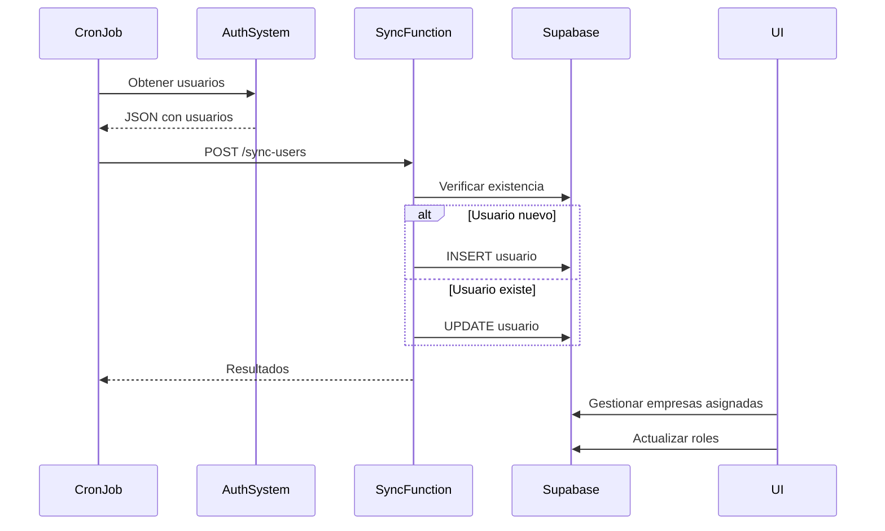

# Sincronización de Usuarios desde Sistema de Autenticación Externo

## Resumen

Se implementó un sistema completo para sincronizar usuarios desde un sistema de autenticación externo hacia la base de datos de ContaEmpresa, y gestionar la asignación de empresas y roles desde la interfaz de administración.

## 1. Edge Function de Sincronización

### Endpoint
```
POST https://uwyoovdvynmhksipzkwg.supabase.co/functions/v1/sync-users
```

### Características
- **Pública**: No requiere autenticación (para ser llamada por cron jobs)
- **Idempotente**: Puede ejecutarse múltiples veces sin duplicar usuarios
- **Automática**: Inserta nuevos usuarios y actualiza existentes

### Formato del Request

```json
{
  "success": true,
  "users": [
    {
      "id": "a61513a7-b090-498e-8e3b-1b93bf8c4971",
      "email": "usuario@ejemplo.com",
      "name": "Pedro Ayala Ortiz",
      "role": "Administrador",
      "permissions": ["admin"],
      "metadata": {
        "empresa_ids": []
      },
      "created_at": "2025-11-15T04:17:55.141935+00:00"
    }
  ]
}
```

### Mapeo de Roles

El sistema mapea automáticamente los roles del sistema externo a los roles internos:

| Rol Externo | Rol Interno |
|------------|-------------|
| Administrador | admin_empresa |
| Contador | contador |
| Usuario | usuario |

### Respuesta Exitosa

```json
{
  "success": true,
  "message": "Usuarios sincronizados correctamente",
  "results": {
    "inserted": 5,
    "updated": 2,
    "errors": []
  }
}
```

### Ejemplo de Uso con cURL

```bash
curl -X POST https://uwyoovdvynmhksipzkwg.supabase.co/functions/v1/sync-users \
  -H "Content-Type: application/json" \
  -d '{
    "success": true,
    "users": [
      {
        "id": "a61513a7-b090-498e-8e3b-1b93bf8c4971",
        "email": "payalaortiz@gmail.com",
        "name": "Pedro Ayala Ortiz",
        "role": "Administrador",
        "permissions": ["admin"],
        "metadata": {},
        "created_at": "2025-11-15T04:17:55.141935+00:00"
      }
    ]
  }'
```

## 2. Gestión de Usuarios desde la Interfaz

### Asignar Usuarios a Empresas

1. **Navegar a Gestión de Empresas**
   - Ir a: `Admin > Gestión de Empresas`

2. **Abrir Modal de Usuarios**
   - Hacer clic en el botón de usuarios (icono morado) en la fila de la empresa

3. **Asignar Usuario**
   - Seleccionar usuario del dropdown
   - Hacer clic en "Asignar"

4. **Actualizar Rol**
   - Cambiar el rol directamente desde el selector en la lista
   - Los cambios se aplican inmediatamente

5. **Desasignar Usuario**
   - Hacer clic en el botón rojo de "Desasignar"
   - Confirmar la acción

### Roles Disponibles

- **Super Admin**: Acceso total al sistema
- **Admin Empresa**: Administrador de la empresa asignada
- **Contador**: Acceso contable a la empresa
- **Usuario**: Acceso básico limitado

## 3. Base de Datos

### Tabla: usuarios

Campos principales:
- `id` (text): UUID del usuario del sistema externo
- `nombre` (text): Nombre completo
- `email` (text): Email único
- `rol` (text): Rol actual
- `empresas_asignadas` (text[]): Array de IDs de empresas
- `permisos` (text[]): Array de permisos
- `metadata` (jsonb): Metadata adicional del sistema externo
- `auth0_id` (text): ID de autenticación externa
- `activo` (boolean): Estado del usuario

### Índices

- `idx_usuarios_email`: Búsqueda rápida por email
- `idx_usuarios_metadata`: Búsqueda en metadata usando GIN

## 4. Servicios Disponibles

### usuariosSupabaseService

```typescript
// Obtener usuarios de una empresa
await usuariosSupabaseService.getUsuariosByEmpresa(empresaId);

// Asignar empresa a usuario
await usuariosSupabaseService.asignarEmpresa(usuarioId, empresaId);

// Desasignar empresa de usuario
await usuariosSupabaseService.desasignarEmpresa(usuarioId, empresaId);

// Actualizar rol de usuario
await usuariosSupabaseService.actualizarRol(usuarioId, nuevoRol);

// Obtener usuarios disponibles para asignar
await usuariosSupabaseService.getUsuariosDisponiblesParaEmpresa(empresaId);

// Obtener todos los usuarios
await usuariosSupabaseService.getAllUsuarios();
```

## 5. Flujo Completo de Sincronización



## 6. Seguridad

### RLS (Row Level Security)

- La tabla `usuarios` tiene RLS habilitado
- Políticas restrictivas basadas en el usuario autenticado
- La Edge Function usa service role key para bypass RLS en sincronización

### Validaciones

- Email único obligatorio
- Rol debe ser válido (constraint check)
- Empresas_asignadas debe ser array válido
- Metadata debe ser JSON válido

## 7. Monitoreo

### Logs de Sincronización

Los logs de la Edge Function están disponibles en:
```
Supabase Dashboard > Edge Functions > sync-users > Logs
```

### Errores Comunes

1. **Error 400**: Formato de JSON inválido
   - Verificar estructura del payload

2. **Error 404**: Tabla no encontrada
   - Verificar que las migraciones se aplicaron correctamente

3. **Error 500**: Error interno
   - Revisar logs de la función para detalles

## 8. Mantenimiento

### Actualizar Metadata

Si necesitas agregar más campos en metadata:

```sql
-- Ejemplo: Agregar campo personalizado
UPDATE usuarios
SET metadata = metadata || '{"departamento": "IT"}'::jsonb
WHERE id = 'usuario-id';
```

### Limpiar Usuarios Inactivos

```sql
-- Desactivar usuarios que no han iniciado sesión en 90 días
UPDATE usuarios
SET activo = false
WHERE ultima_conexion < NOW() - INTERVAL '90 days';
```

## 9. Testing

### Test Manual de Sincronización

1. Usar la herramienta de tu preferencia (Postman, curl, etc.)
2. Enviar request con usuarios de prueba
3. Verificar en Supabase que se crearon/actualizaron
4. Verificar en la UI que aparecen en el dropdown

### Test de Asignación

1. Sincronizar usuarios
2. Ir a Gestión de Empresas
3. Abrir modal de usuarios de cualquier empresa
4. Asignar, cambiar rol, y desasignar
5. Verificar que los cambios se reflejan correctamente

## 10. Próximos Pasos (Opcional)

- [ ] Webhook para sincronización en tiempo real
- [ ] Dashboard de usuarios globales
- [ ] Logs de auditoría de cambios de roles
- [ ] Notificaciones por email al asignar/desasignar
- [ ] Sincronización bidireccional de roles
